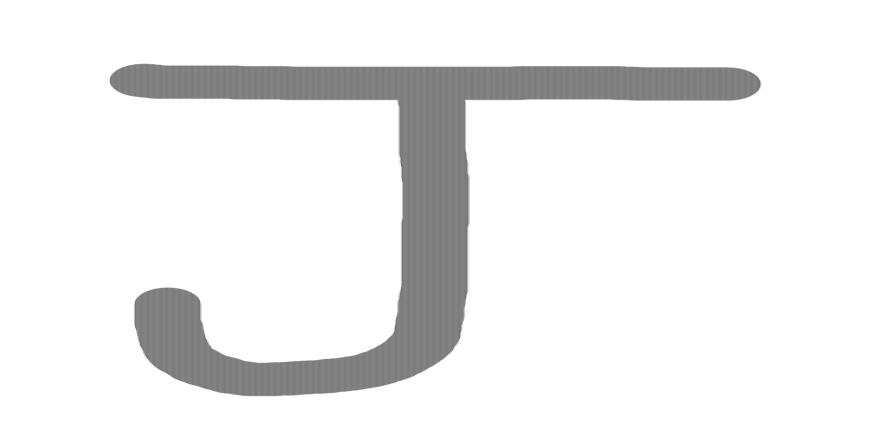
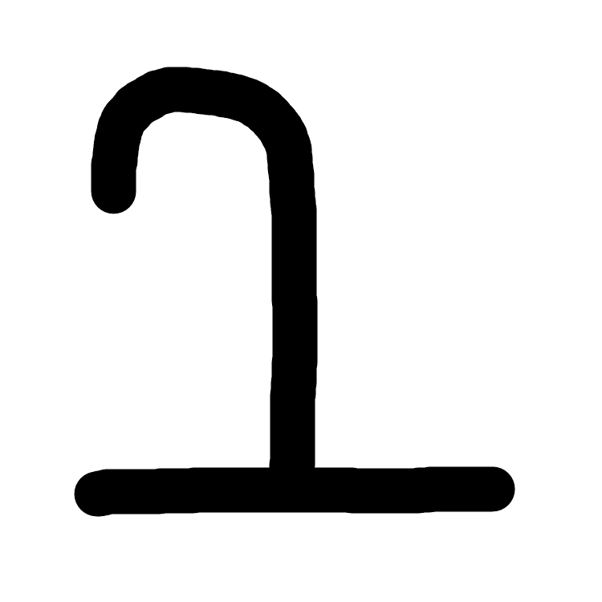
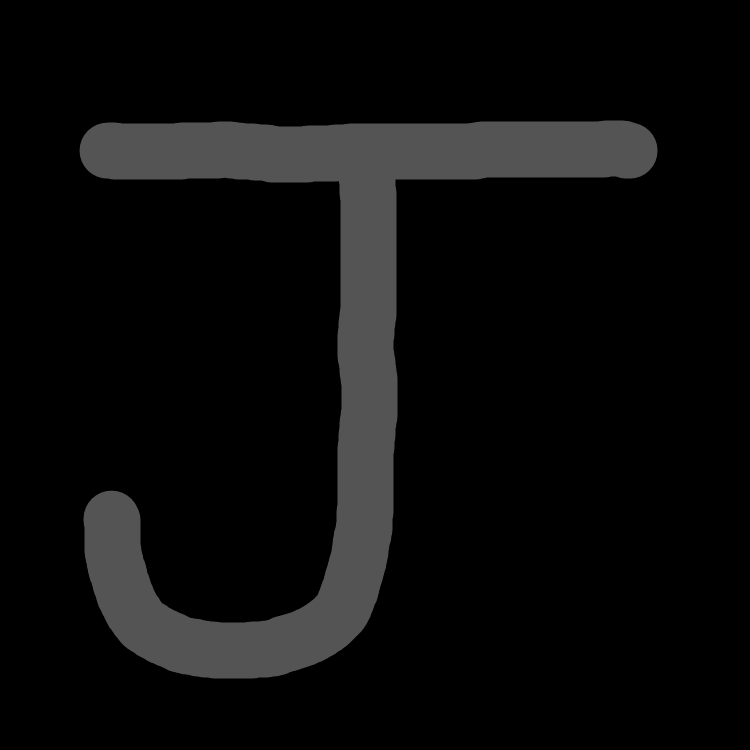
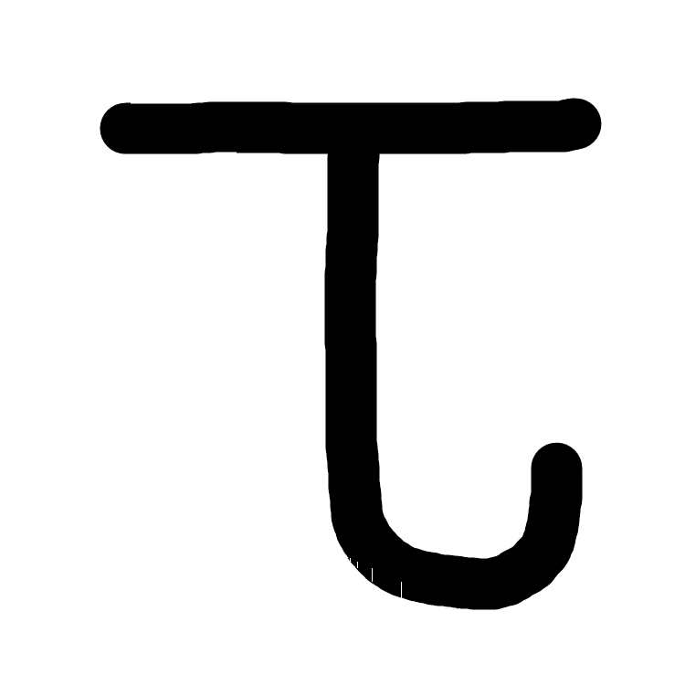

# Transformações Lineares em Imagens 🖼️✏️

Este projeto demonstra, de forma prática, como **transformações lineares** podem ser aplicadas em imagens digitais para manipulação, distorção e análise visual, sem depender de bibliotecas avançadas como OpenCV.
O objetivo é implementar **do zero** funções que alteram, rotacionam, escalonam e transformam imagens usando apenas **álgebra linear**.

---

## 📌 Objetivo

Implementar e aplicar transformações lineares sobre imagens utilizando **operações matriciais** com Python e NumPy, demonstrando a relação direta entre álgebra linear e processamento digital de imagens.

---

## 📂 Estrutura do Projeto

```
├── transformacoes_lineares.ipynb    # Notebook principal
├── uteis.py                         # Funções auxiliares de manipulação de imagens
├── images/                          # Pasta com imagens de teste
├── results/                         # Pasta com as imagens resultantes das tranformações
└── README.md                        # Este arquivo
```

---

## 🛠 Tecnologias Utilizadas

* **Python**
* **NumPy** – manipulação matricial
* **Pillow (PIL)** – carregamento e salvamento de imagens
* **Matplotlib** – exibição das imagens

---

## 📜 Funcionalidades

* **Carregar imagens** e convertê-las em matrizes NumPy
* **Salvar imagens** transformadas
* **Exibir imagens** com título e tamanho personalizado
* **Converter para escala de cinza**
* Aplicar transformações lineares como:

  * Escalonamento (resize)
  * Rotação
  * Reflexão
  * Cisalhamento (shear)
* **Aplicação de Interpolação Bilinear** para evitar pixels vazios

---

## 📷 Exemplos e Resultados

### 1️⃣ Imagens Original Preta e Branca e Colorida


---

### 2️⃣ Escalonamento



---

### 3️⃣ Rotação


---

### 4️⃣ Reflexão Horizontal



---

### 5️⃣ Cisalhamento (Shear)


---

### 6️⃣ Aplicações Extras





---

## 💡 Aprendizados

* Aprofundamento no uso de **matrizes** e **operações lineares** para manipulação de imagens.
* Entendimento da relação entre **geometria** e **pixels**.
* Construção de um pipeline manual para modificações visuais.


